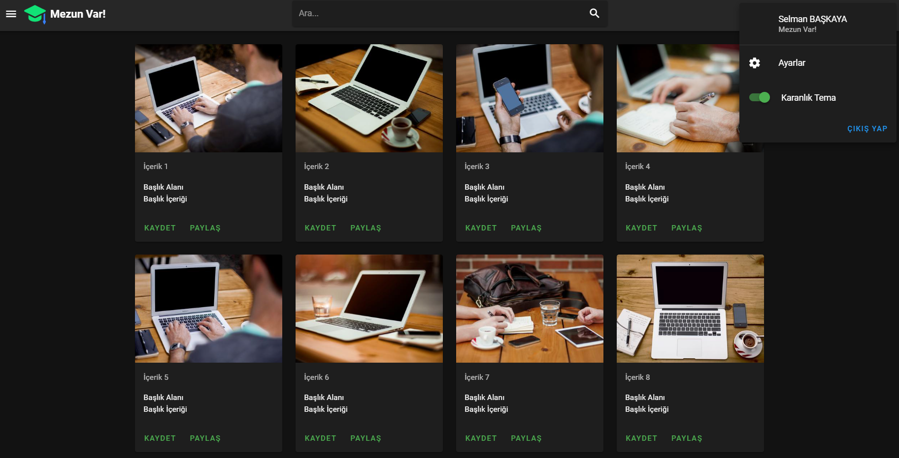
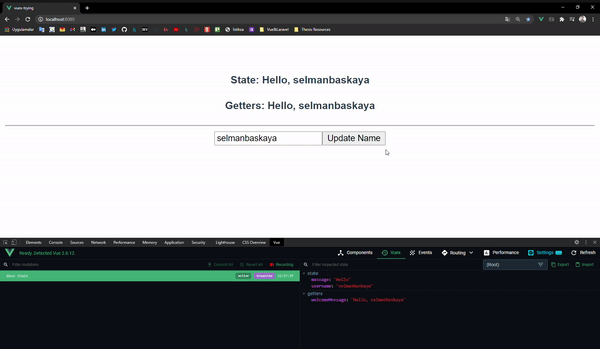

# Projects
## YouTube-UI


## Vuex


## Projects setup
### for YouTube-UI
```
- npm install
- npm install -g @vue/cli
- vue add vuetify
```

### for Vuex
```
- npm install
- npm install -g @vue/cli
- npm install vuex --save
```

### Compiles and hot-reloads for development
```
npm run serve
```

### Compiles and minifies for production
```
npm run build
```

### Customize configuration
See [Configuration Reference](https://cli.vuejs.org/config/).
